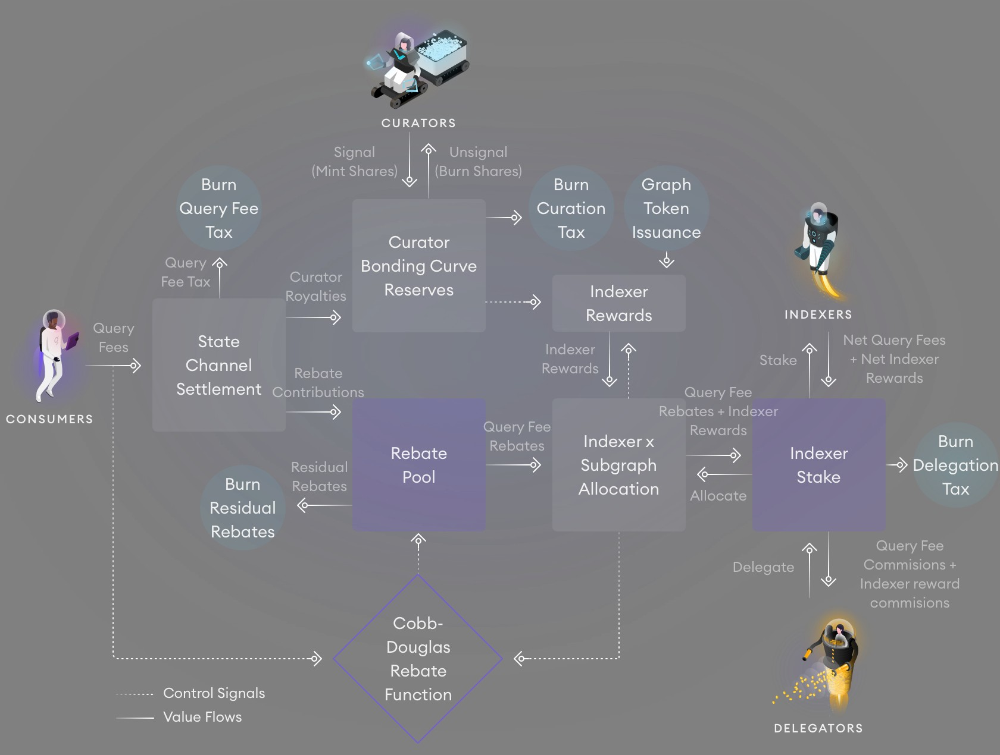
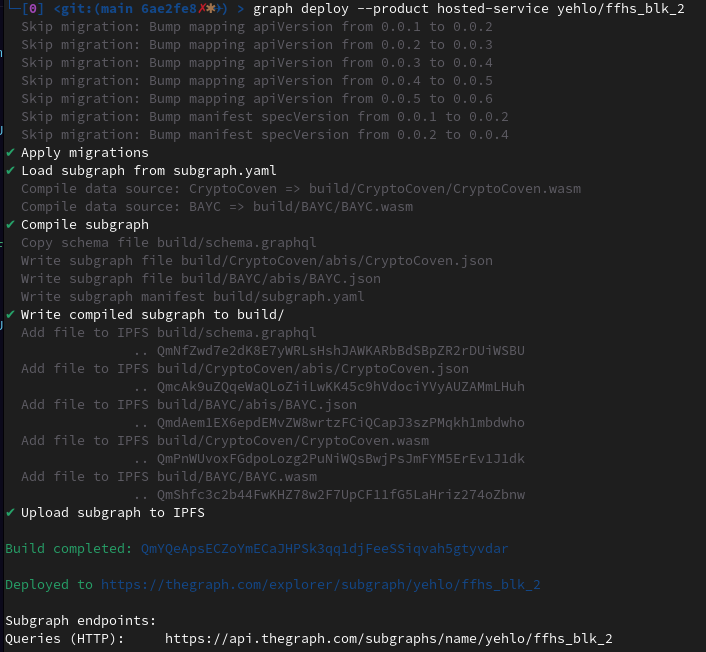
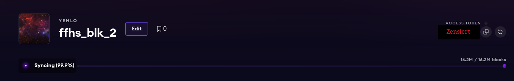
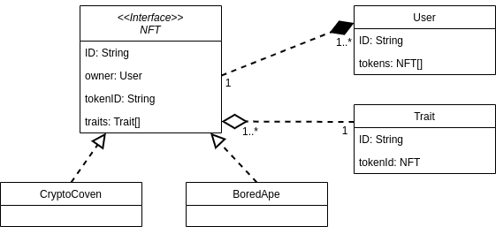

# NFT Subgraph
**Semesterarbeit | Joshua Leuenberger | FFHS | BLK 2022/23**

## Inhaltsverzeichniss
* 1. [Einleitung](#Einleitung)
	* 1.1. [Abgrenzungen](#Abgrenzungen)
* 2. [Theoretische Grundlagen](#TheoretischeGrundlagen)
	* 2.1. [Smart Contracts](#SmartContracts)
	* 2.2. [NFT](#NFT)
		* 2.2.1. [IPFS](#IPFS)
	* 2.3. [The Graph Protocol](#TheGraphProtocol)
		* 2.3.1. [Subgraph](#Subgraph)
		* 2.3.2. [Hosted Service](#HostedService)
	* 2.4. [GraphQL](#GraphQL)
* 3. [Implementierungsidee - Subgraph für NFTs](#Implementierungsidee-SubgraphfrNFTs)
	* 3.1. [Installation Graph CLI](#InstallationGraphCLI)
	* 3.2. [Hosted Service Registration](#HostedServiceRegistration)
		* 3.2.1. [Access Token](#AccessToken)
	* 3.3. [Subgraph Entwicklung](#SubgraphEntwicklung)
		* 3.3.1. [CryptoCoven als Basis](#CryptoCovenalsBasis)
		* 3.3.2. [Erweiterungen `subgraph.yaml`](#Erweiterungensubgraph.yaml)
		* 3.3.3. [CryptoCoven Entität](#CryptoCovenEntitt)
		* 3.3.4. [handleTransfer](#handleTransfer)
		* 3.3.5. [GraphQL Schema erstellen](#GraphQLSchemaerstellen)
		* 3.3.6. [Upload Subgraph](#UploadSubgraph)
	* 3.4. [Erweiterung mit BAYC](#ErweiterungmitBAYC)
		* 3.4.1. [Einmalige ID](#EinmaligeID)
		* 3.4.2. [Abstraktion](#Abstraktion)
* 4. [Resultat](#Resultat)
  * 4.2. [Beispiele](#examples)  
  * 4.1. [Potentielle Erweiterung zusätzlicher NFTs](#PotentielleErweiterungzustzlicherNFTs)
* 5. [Weiterführende Arbeiten](#WeiterfhrendeArbeiten)
* 6. [Fazit](#Fazit)
* 7. [Selbstständigkeitserklärung](#eigstdktserklrung)
* 8. [Quellen](#Quellen)


##  1. <a name='Einleitung'></a>Einleitung
Damit Daten von einer Blockchain gelesen werden können, müssen sämtliche Blöcke nach der betroffenen Transaktion mit dem gewünschten Datensatz durchsucht werden. Bei der Ethereum Blockchain mit ca. 16 Billionen Blöcken¹ und einer benötigten Speichermenge von gut 1TB¹ kann diese Suche viel Zeit und Rechenleistung in Anspruch nehmen.

Die stetig wachsende Menge an Smart Contracts [1] führt hierbei zu einem immer grösseren Bedarf danach, die Lesegeschwindigkeit der Blocks zu verbessern. Webseiten die viele Leseoperation auf einer Blockchain ausführen, wie zum Beispiel Etherscan, haben einen eigenen Service zum lesen der Daten einer Blockchain und darauffolgendem Speichern in einer Datenbank entwickelt [2].

Diese Problematik führt zu einer stark heterogenen Vorgehensweise zum Lesen einer Blockchain. Zur Homogenesierung dieses Prozesses wurde von Edge & Node das The Graph Protocol (künftig mit The Graph abgekürz) entwickelt. Mit The Graph können relevante Blocks indexiert und in einer Graph Datenbank gespeichert werden. Das Indexieren wird fortlaufend durchgeführt, womit ein Entwickler die für ihn notwendigen Daten vom zugehörigen Subraph mittels GraphQL auslesen und weiterverarbeiten kann.

In dieser Arbeit wird im Rahmen einer Modularbeit ein sogenannter Subgraph entwickelt zum Indexieren verschiedener NFT Kollektionen. Konkret werden nachfolgend die Tokens CryptoCoven sowie BoredApeYachtClub in einem Subgraph zusammengefasst. Die dadurch zur Verfügung stehenden Daten werden exemplarisch mittels GraphQL ausgelesen. Mit dem dadurch erlangten Wissen wird auf die mögliche Anwendung von The Graph eingegangen und ein Fazit über den Einsatz gezogen.

¹ Stand Dezember 2022

###  1.1. <a name='Abgrenzungen'></a>Abgrenzungen
Zur Minderung der Aufwände werden einige Arbeiten abgegrenzt und in Form einer möglichen weiterführenden Arbeit verfolgt. Der entwickelte Subgraph wird nicht in ein Frontend oder ähnliches inkludiert sondern ausschliesslich über die Webseite des Herstellers getestet. Zudem handelt es sch bei dem Resultat um einen Prototypen der für den produktiven Einsatz nicht geeignet ist.

Eine technische Dokumentation sowie ein Handbuch zur Inbetriebnahme sind nicht inbegriffen. Zum besseren Verständnis des Quellcodes wurde dieser lediglich mit Kommentaren und durch Verwendung sprechender Variablen und Methodennamen ergänzt. Technische Grundlagen wie den Aufbau des Projekts auf Github werden vorausgesetzt und können bei Bedarf der Herstellerdokumentation entnommen werden [3]. 

Grundlagen zur Blockchain wie deren Aufbau wird vorausgesetzt und in den nachfolgenden theoretischen Grundlagen nicht erwähnt.

Es werden ausschliesslich off-chain NFTs während dieser Arbeit behandelt. Im Rahmen dieser Arbeit werden nur NFT Kollektionen von Bildern genauer untersucht. 

##  2. <a name='TheoretischeGrundlagen'></a>Theoretische Grundlagen


###  2.1. <a name='SmartContracts'></a>Smart Contracts
Bei dem Smart Contract handelt es sich grundsätzlich um Code der auf einer Blockchain gespeichert wird. Mit dem Smart Contract werden simple if/then Operationen angeboten. Gängigerweise können mit einem Smart Contract auf diese Weise z.B. Tokens an andere Benutzer versendet, neu erstellt, allenfalls zerstört (burned), etc. werden [4]. 

Im Smart Contract befinden sich sämtliche Informationen die benötigt werden um das NFT ausfindig zu machen und darzustellen [4].

###  2.2. <a name='NFT'></a>NFT
Bei einem non-fungible token (sinngemäss übersetzt: nicht gleiches / verschiedenes Token) handelt es sich um ein digitales Gut mit einmaliger Signatur. Mit dem NFT wird somit eine Knappheit eines Guts in der digitalen Welt eingeführt. Unter einem NFT werden nicht nur die allseits Bekannten Bilder sondern auch Videos, Avatare, Musik, etc. verstanden [5]. 

Das NFT wird auf einer Blockchain gespeichert. Konkreter wird das NFT bei dessen Erstellung (dem "minting") in Form einer bekannter ID innerhalb des Contracts gespeichert. 

Der Smart Contract eines NFTs befolgt heutzutage den ERC721 Standard. Hierbei handelt es sich um ein Interface welches einige Vorgaben enthält, welche Funktionalitäten abgebildet werden müssen [6]. 

####  2.2.1. <a name='IPFS'></a>IPFS
Bei einem off-chain NFT wird ausschliesslich die ID auf der Blockchain gespeichert. Beispielsweise fehlen bei den NFTs der BYAC Kollektion somit die eigentlichen Bilder sowie die NFT Attribute wie Felltyp, Gesicht, Auge, etc. Diese Informationen werden auf dem Interplanetären Filesystem (IPFS) gespeichert und beim Contract wird lediglich ein Hash zur Identifikation der Speicherstelle statisch definiert [7]. 

Bei dem IPFS handelt es sich um p2p Storage Netzwerk, wobei sich die Peers irgendwo auf der Welt befinden können. Um ein Objekt vom IPFS auszulesen wird der sogenannte content identifier (CID) als Adresse genutzt. Innert einer geteilten Hash Tabelle (distributed hash table - DHT) wird sowohl gespeichert welche Peers über welchen Inhalt verfügen als auch wo sich die Peers befinden. Gerouted zu dem Peer mit der kürzesten werden die über die CID angeforderten Daten validiert und als Antwort retourniert [8]. 

Damit also ein NFT samt Bild und zugehörigen Attributen dargestellt werden kann, werden im Hintergrund jeweils IPFS Anfragen getätigt. Die notwendigen Informationen wie Token ID und IPFS CID können dem zugehörigen Smart Contract entnommen werden.

Auf weitere Anwendungsfälle vom IPFS wird nicht eingegangen.

###  2.3. <a name='TheGraphProtocol'></a>The Graph Protocol
Bei The Graph Protocol (künftig mit The Graph abgekürzt) handelt es sich um ein Infrastruktur Protokoll zur Indexierung von Netzwerken wie IPFS und Etherium [9]. Mit The Graph wird es möglich die Blöcke zu einem Smart Contract einer unterstützten Blockchain in einer Graph Datenbank abzuspeichern. 

The Graph hat ein eigenes Ökosystem und baut bei der technischen Implementation auf spezifische Rollen wie Indexers, Delegators und Curators auf. Die Rollen werden durch das zugehörige Graph Token (GRT) motiviert ihre Aufgabe korrekt zur erfüllen [10]. Die Interaktion dieser Rollen sowie wie die Entwickler damit interagieren kann der nachfolgenden Grafik entnommen werden. 

||
|:--:|
|_Abbildung 1: The Graph Architecture [11]_|

Da im Rahmen diser Arbeit ausschliesslich die Interaktion als Entwickler ("Consumer"). Weitere technische Details zum Ökosystem können beim Hersteller entnommen werden.

####  2.3.1. <a name='Subgraph'></a>Subgraph
Damit nun nicht jede Webapplikation die mit NFTs interagiert eine eigene Implementation zum auslesen der NFT Metadaten benötigt, können die Consumers sogenannte Subgraphs entwickeln. Ein Subgraph wird durch das dezentrale Graph Netzwerk betrieben und kann sobald indexiert mittels GraphQL auf dessen Inhalt befragt werden [3], [12].

Ein Graph wird über eine Yaml Datei `subgraph.yaml` deklariert. Hierbei wird der Smart Contract sowie einige damit einhergehende Metadaten wie Blockain Netzwerk, typ, zusätzliche Features etc. Damit The Graph weiss, bei welchen Transaktionen (basierend auf Funktionsaufrufen des Smartcontracts) welche Webassembly Funktion aufgerufen werden soll [3].

Über diverse AssemblyScripts werden die in den Transaktionen enthaltenen Informationen auf eine Klasse gemapped. Der Entwickler hat hierbei volle Freiheit und kann somit die für ihn notwendigen Informationen auf das notwendigste Beschränken [3].

Damit die mittels AssemblyScript erstellten Klassen nun mittels GraphQL angesprochen werden können, werden die Entitäten über die `schema.graphql` Datei definiert. Hierbei steht dem Entwickler eine limitierte Form des öffentlichen graphQL Standards zur Verfügung. Mit dem Schema können die einzelnen Entitäten miteinander vernetzt und customisierte Suchoperationen entwickelt werden [3].


####  2.3.2. <a name='HostedService'></a>Hosted Service
Standardmässig wird ein Subgraph heutzutage auf der eigenen Graph Chain (GRT) gespeichert. Da es jedoch noch ein paar Features wie die Interaktion mit IPFS gibt, welche über diese Methode nicht zur Verfügung stehen, bietet The Graph noch einige Monate den Hosted Service an [13].

Wie es der Name vermuten lässt, wird ein Subgraph auf diese Weise in einer anderen Chain, der dem Ethereum Mainnet, gehosted [13]. 

The Graph plant ein baldiges Sunsetting dieses Services im Verlauf von Q1 2023.

Während dem Projektbeginn war es noch nicht möglich auf dynamische Weise die Attribute eines NFTs vom IPFS auszulesen [14].  

###  2.4. <a name='GraphQL'></a>GraphQL
Bei GraphQL handelt es sich um eine Sprache, die auf Serverseite bearbeitet wird und eine API zur Verfügung stellt. GraphQL zielt darauf ab dem Client nur die von ihm angefragten Informationen zurückzuliefern, was zu einer entsprechend hohen Performanz und Flexibilität der API führt [15]. 

Analog dem Namen werden Daten hierbei in Form eines Graphs modelliert [16].

##  3. <a name='Implementierungsidee-SubgraphfrNFTs'></a>Implementierungsidee - Subgraph für NFTs
Es wird vorausgesetzt, dass auf dem Entwicklungsgerät eine aktuelle `Node.js` Version und ein Paketmanager wie `nvm` installiert werden.

###  3.1. <a name='InstallationGraphCLI'></a>Installation Graph CLI
The Graph stellt ein CLI Werkzeug zur Verfügung, mit welchem auf der lokalen Maschine ein Subgraph initialisiert werden kann [17]. 

Dieses wird auf einfache Weise mittels `npm` installiert:
```bash
npm install -g @graphprotocol/graph-cli
```

###  3.2. <a name='HostedServiceRegistration'></a>Hosted Service Registration
Zunächst wird über das private Github Konto ein Login beim zugehörigen Endpunkt von The Graph erstellt und darauffolgend im Dashboard ein Subgraph mit dem gewünschten Namen hinzugefügt [18].

Nach der Erstellung des Subgraphs werden die zur Initialisierung notwendigen Befehle angezeigt:

```bash
graph init --product hosted-service $username/$graphName
cd $graphName
graph codegen && graph build
```

####  3.2.1. <a name='AccessToken'></a>Access Token
The Graph stellt für jeden Benutzer ein Access Token zur Verfügung, mit welchem die Authorisierung gegenüber der Graph API sichergestellt wird. Der Subgraph Upload kann nur mit einem gültigen Token durchgeführt werden.

###  3.3. <a name='SubgraphEntwicklung'></a>Subgraph Entwicklung
Damit die Subgraph-Entwicklung gestartet werden kann, wird die Smart Contract Addresse des entsprechenden NFTs benötigt. Diese Adresse lässt sich durch eine Suche auf [Etherscan](https://etherscan.io/) ausfindig machen.

####  3.3.1. <a name='CryptoCovenalsBasis'></a>CryptoCoven als Basis
Auf Etherscan kann die Addresse `0x5180db8F5c931aaE63c74266b211F580155ecac8` ausfindig gemacht werden. Mit dieser Smart Contract Addresse des Crypto Coven Tokens kann nun die Subgraph Entwicklung gestartet werden.

Analog der Anleitung auf The Graph können die Graph CLI Befehle beim Entwicklungsstart mit der Contract Addresse erweitert werden [3].


Im Falle des CryptoCoven Contracts kann folgender Befehl genutzt werden:
```bash
graph init \
  --product hosted-service
  --from-contract 0x5180db8F5c931aaE63c74266b211F580155ecac8 \
  --network mainnet \
  --contract-name CryptoCoven \
  --index-events
  $username/$graphName
```

**Mutation des generierten Subgraphs**
Da nur die Tokens Relevant sind, können nun alle nicht notwendigen Dateien sowie Events von dem generierten `subgraph.yaml` entfernt respektive entsprechend überarbeitet werden.

Aufgrund von der hohen Menge an Dateien sowie Codestellen die gekürzt werden können, wird nachfolgend lediglich auf die relevanten Anpassungen eingegangen.

####  3.3.2. <a name='Erweiterungensubgraph.yaml'></a>Erweiterungen `subgraph.yaml`
Damit die Indexierung der Daten weniger Rechenintensiv ist und The Graph nicht sämtliche Blocks analysieren muss, wird der Startblock angegeben. Dieser kann ebenfalls mittels Etherscan ausfindig gemacht werden, indem die Block ID der ersten Transaktion des Smart Contracts aufgesucht wird. Bei den Crypto Covens ist das der Block mit der ID `13547115`.

Da der Subraph zudem Daten vom ipfs beziehen soll, muss das Feature im yaml entsprehcend erweitert werden. 
```yaml
features:
  - ipfsOnEthereumContracts
```

Analog dem ERC721 Standard haben sämtliche NFT Smart Contracts ein Transfer Event, welches die TokenID sowie die Empfänger Addresse (also der neue Eigentümer) des Tokens beinhalten. Die Events können somit auf das `Transfer` Event und die dazugehörige `handleTransfer` Methode gekürzt werden.

Als Entitäten soll es künftig nur noch die `CryptoCoven`, deren Attribute respektive `Traits` und den `User` geben. 

####  3.3.3. <a name='CryptoCovenEntitt'></a>CryptoCoven Entität
Der generierte Subgraph enthält die CryptoCoven an sich nicht, sondern umfasst Entitäten wie `Transfer`, `Approval`, etc. Hierbei handelt es sich um Klassen, die beim Smart Contract enthalten sind. Damit der Subgraph nun die CryptoCoven Entität samt dessen Traits kennt, werden die entsprechenden Modelle und zugehörigen WebAssembly Mappings entsprechend überarbeitet. 

Das CLI generiert einige Schemas unter `./generated/schema/` die zur Referenz gezogen werden können. Im Rahmen dieses Projekts werden die finalisierten Modelle in `./models` geführt. Das Modell umfasst die für den Subgraph relevanten Informationen. Es wird nachfolgend nicht konkreter auf das Modell eingegangen, grundsätzlich handelt es sich dabei um eine Klasse mit Getters und Setters. Details können dem Quellcode entnommen werden.

####  3.3.4. <a name='handleTransfer'></a>handleTransfer
Im `subgraph.yaml` wird ersichtlich, dass die Modelle im WebAssembly Script `crypto-coven.ts` generiert werden. In diesem Script wird nun lediglich die funktion `handleTransfer(event: TransferEvent)` benötigt.

Diese wird nun so umgeschrieben, dass bei jedem Transfer die TokenID ausgelesen und mit den Informationen auf dem IPFS erweitert wird. Damit The Graph mit dem IPFS interagieren kann, muss die zugehörige Klasse importiert werden. Des Weiteren wird der CID des Smart Contracts bezüglich dem IPFS benötigt, dieser kann an entsprechender Stelle im Contract ausgelesen werden. Mit diesen Informationen lassen sich die Metadaten des Tokens vom IPFS auslesen.

```Typescript
import { ipfs, json } from '@graphprotocol/graph-ts'
const ipfshash = "QmSr3vdMuP2fSxWD7S26KzzBWcAN1eNhm4hk1qaR3x3vmj"
let metadata = ipfs.cat(ipfshash + token.tokenURI)
```

Damit die CryptoCovens nicht bei jedem Transfer Event neu generiert werden, wird zuvor geprüft, ob diese bereits indexiert wurde und nur bei nicht Existenz generiert.

Nachfolgend oberflächlich beschrieben:
```Typescript
let token = CryptoCoven.load(event.params.tokenId.toString())
if (!token){
  generateCoven()
}
else {
  updateLastUpdated()
  updateOwner()
}
``` 

####  3.3.5. <a name='GraphQLSchemaerstellen'></a>GraphQL Schema erstellen
Das in den Modellen festgehaltene Layout kann nun im GraphQL Schema `schema.graphql` ergänzt werden. Das Schema kann alle Attribute enthalten die das Modell besitzt sowie zusätzliche Attribute die auf andere Schemas respektive Entitäten verweisen. 

Die CryptoCoven Entität wird 1:1 analog dem Modell geführt und verfügt zuzüglich über eine Referenz auf den Besitzer. Nachfolgend ein rudimentäres Beispiel, von ursprünglichen und referenzierten Attributen beim User:

```GraphQL
type CryptoCoven implements NFT @entity {
  id: ID!
  owner: User!
}

type User @entity {
  id: ID!
  tokens: [CryptoCoven!] @derivedFrom(field: "owner")
}
```

####  3.3.6. <a name='UploadSubgraph'></a>Upload Subgraph
Sobald ein MVP Stand erreicht wird, kann der Code mittels Graph CLI entsprechend deployed werden. Hierzu bietet The Graph wiederum die notwendigen Befehle an: 

```bash
graph auth --product hosted-service $accessToken
graph deploy --product hosted-service $username/$graphName
``` 

Nach dem Deployment wird in der Konsole eine URL ausgegeben, bei welcher der Graph getestet werden kann. 
||
|:--:|
|_Abbildung 2: Konsolen Ausgabe nach dem Deployment_|

Im Dashboard des Subgraphs wird ersichtlich, dass The Graph die damit zusammenhängenden Blocks scannt und jeweiligen Entitäten indexiert. Der Fortschritt kann dem Ladebalken entnommen werden.

||
|:--:|
|_Abbildung 3: Screenshot von The Graph nach dem Deployment_|

###  3.4. <a name='ErweiterungmitBAYC'></a>Erweiterung mit BAYC
Damit der Subgraph mit zusätzlichen NFTs respektive Smart Contracts erweitert werden kann, bietet The Graph einen entsprechenden Befehl. Nachfolgend konkrete Beispiel mit der Adresse des BAYC Smart Contracts.

```bash
graph add 0xBC4CA0EdA7647A8aB7C2061c2E118A18a936f13D --contract-name BAYC
```

Zunächst werden die gleichen Operationen vorgenommen wie bei der initialen Bereitstellung der CryptoCovens:
* Startblock ausfindig machen und ergänzen
* IPFS Hash ausfindig machen und festhalten
* Entfernen nicht benötigter Events, Eventhandlers und Mappings
* Erweitern mit BAYC Modell
* Überarbeiten des `handleTransfer` Eventhandlers
* GraphQL Schema erweitern

####  3.4.1. <a name='EinmaligeID'></a>Einmalige ID
Die im Schema festgehaltene ID identifiziert die Entität und darf somit nicht doppelt vorkommen. Entsprechend muss in der `handleTransfer` Funktion sichergestellt werden, dass die IDs der jeweiligen Kollektionen nicht kollidieren. Zur Vereinfachung wurde hierbei ein zusätzliches Attribut `collection` eingeführt und wird mit der TokenID zur Entitäts ID verknüpft.

####  3.4.2. <a name='Abstraktion'></a>Abstraktion
Mit der Erweiterung um ein zusätzliches Token wird ebenfalls ein gewisser Grad von Abstraktion notwendig, damit einerseits keine Doppelspurigkeiten entstehen und andererseits alle Referenzierungen der Entitäten vollumfänglich funktionieren. Im Schema kann beispielsweise die User Entität seine Tokens von zwei verschiedenen Entitäten beziehen, wehalb ein Interface notwendig wurde.

Der Subgraph wird somit massgeblich überarbeitet und ein überliegendes NFT Modell `NFT.ts` wurde als Interface ergänzt und alle Gemeinsamkeiten werden in diesem geführt. 

Da das `Transfer` und `User` Modell ebenfalls bei beiden identisch ist, werden auch diese nur einmalig gepflegt. 

Des Weiteren wurde die Trait und User Generation in die entsprechenden helper Methoden `processAttribute()` und `processUser()` ausgelagert.

##### Trait Entität
Zuvor wurden die Traits direkt in die Modelle respektive das Schema eingebettet. Dies hat nicht nur zur Folge, dass jeder Trait separiert verarbeitet und gepflegt werden muss sondern auch, dass die konkreten NFT Modelle zusätzliche Komplexität mit sich bringen.

Bei genauer Inspektion der jeweiligen IPFS json Dateien konnten gemeinsame Nenner identifziert werden und somit ein Teil der Attribute auf standardisierte Weise verarbeiten und in Form einer gesonderten Entität geführt werden. Entsprechend erweitert wurden die `handleTransfer` Funktionen der jeweiligen Kollektionen sowie das `schema.graphql` mit zusätzlichen Entität sowie zugehörigen Referenz auf die NFTs.

Mit der aktuellen Implementation werden zur Vereinfachung nur Traits mit einem String als Wert gespeichert. 

##  4. <a name='Resultat'></a>Resultat
Der Programmcode kann dem [Git Repository](https://github.com/yehlo/NFT_Subgraph_FFHS) entnommen werden. Dem Entwickler steht der folgende Graph zur Verfügung (nur die relevanten Attribute wurden visualisiert). 

||
|:--:|
|_Abbildung 4: Visualisierung des entwickelten Subgraphs_|

###  4.1. <a name='examples'></a>Beispiele
Über die folgende URL können GraphQL Queries versendet und getestet werden: https://api.thegraph.com/subgraphs/id/QmYQeApsECZoYmECaJHPSk3qq1djFeeSSiqvah5gtyvdar/graphql. 


Die nachfolgenden Queries wurden über die obige URL ausgeführt und getestet. Es werden nur wenige Beispiele vorgestellt. 

**Anzeigen von CryptoCovens**  
```graphql
query example1 {
  nfts(where: {collection: "CryptoCoven"}, first: 10) {
    tokenId
    externalURL
    image
  }
}
```

Es wird eine Liste von CryptoCovens zurückgegeben.
```json
{
  "data": {
    "nfts": [
      {
        "tokenId": "1",
        "externalURL": "https://www.cryptocoven.xyz/witches/1",
        "image": "https://cryptocoven.s3.amazonaws.com/nyx.png"
      },
      {
        "tokenId": "10",
        "externalURL": "https://www.cryptocoven.xyz/witches/10",
        "image": "https://cryptocoven.s3.amazonaws.com/e3b346d2af17b81b2deb43abb68b421f.png"
      },
      ...
}
```


**Suche nach einem BAYC Token mit spezifischer ID**  
```graphql
query example2 {
  nfts(where: {collection: "BoredApe", tokenId: "15"}) {
    tokenId
    image
  }
}
```

Es wird das gesuchte NFT zurückgegeben.

```json
{
  "data": {
    "nfts": [
      {
        "tokenId": "15",
        "image": "ipfs.io/ipfs/QmeGWaFNJyVpkr1LmkKye7qfUGwK9jTRW2sMxKnMDrJKtr"
      }
    ]
  }
}
```

**Auslesen von BAYC Traits**  
```graphql
query example3 {
  traits(where: {collection: "BoredApe"}, first: 50) {
    traitName
    traitValue
    tokenId {
      id
      image
    }
  }
}
```
Es wird eine Liste an Traits zurückgegeben, die einerseits den eigentlichen Trait ausweisen und andererseits den Link zum zugehörigen Token und dessen Bild schaffen. 
```json
{
  "data": {
    "traits": [
      {
        "traitName": "Background",
        "traitValue": "Aquamarine",
        "tokenId": {
          "id": "BoredApe_1000",
          "image": "ipfs.io/ipfs/QmS8s3b1g6gUM83QRTkPD7LFYmVPxhpNgbtvbhvTAk5uJk"
        }
      },
      {
        "traitName": "Clothes",
        "traitValue": "Toga",
        "tokenId": {
          "id": "BoredApe_1000",
          "image": "ipfs.io/ipfs/QmS8s3b1g6gUM83QRTkPD7LFYmVPxhpNgbtvbhvTAk5uJk"
        }
      },
      ...
}
```

**Auslesen von ein paar Users und dessen Tokens**
```graphql
query example4 {
  users(first: 5){
    id
    tokens {
      id
    }
  }
}
``` 

Es wird eine Liste von Users und dessen Tokens ausgegeben. 
```json
{
  "data": {
    "users": [
      {
        "id": "0x001aba7087f49a135ffb121a40684416824e9c34",
        "tokens": [
          {
            "id": "BoredApe_1120"
          },
          ...
        ]
      },
      {
        "id": "0x00668bd79ede077b99bbe1c4db59418bc333d4cf",
        "tokens": [
          {
            "id": "BoredApe_773"
          },
          ...
...
```

###  4.2. <a name='PotentielleErweiterungzustzlicherNFTs'></a>Potentielle Erweiterung zusätzlicher NFTs
Ein zusätzliches NFT könnte mit dem aktuellen Aufbau mit wenig Aufwand integriert werden. Hierzu kann nun im Groben wie folgt vorgegangen werden:
1. Erweiterung mit entsprechendem Smart Contract mittel `graph add` 
2. Anpassungen `subgraph.yaml` 
   1. Startblock ergänzen
   2. Entitäten auf das Token und die gegebenen `Trait` und `User` beschränken
   3. Nicht notwendige Eventhandlers entfernen
3. `./generated` Kann entfernt werden
4. Entsprechendes Modell bei `./models` ergänzen (am einfachsten ein bestehendes kopieren und mutieren)
5. Mapping in `./src/script.ts` basierend analog den anderen NFTs durchführen
6. Zusätzliches Schema in `schema.graphql` ergänzen
7. Upload des Subgraphs mittels `graph deploy`

##  5. <a name='WeiterfhrendeArbeiten'></a>Weiterführende Arbeiten
Der erstellte Subgraph bietet sehr viel Raum zur Verbesserung. Nebst dem Einführen weiterer NFT Kollektionen können aktuell nur die herkömmlichen Attribute in Form von Traits gesucht werden. Die Opensea Metadata Standard Dokumentation beschreibt jedoch noch diverse weitere Typen die künftig integriert werden könnten [19].  

Aktuell wird Gebrauch von der erforderten `Transfer` Methode aller ERC721 Tokens gemacht, damit bei jedem Transfer auch der aktuelle Besitzer aktualisiert werden kann. Einige andere Kollektionen wie beispielsweise die CryptoPunkts besitzen ein `Assign` Event, dieses ist immer das erste Event, bei welchem das Token generiert wird. Somit könnte die Token Generation und Owner Zuweisung respektive User Generation über die spezifischen Events abgehandelt werden. Ob nun jedoch der Einsatz beider Events gegenüber dem Transfer Event weniger Rechenleistung beansprucht muss zuvor genauer analysiert werden.

Das Schema bietet aktuell keine erweiterte Suchfunktion an, wie es mit The Graph möglich wäre. Bei einer künftigen Erweiterung wäre es somit ebenfalls von Vorteil eine sogenannte "fulltext" Search hinzuzufügen, mit welchem z.B. sämtliche NFTs nach einem gewissen Wert durchsucht werden könnten [20]. 

On-Chain NFTs wären zwar mit dem aktuellen Design möglich, es bedarft jedoch einer grösseren Erweiterung, auch die Metadaten dieser Tokens in Form von Traits aufzunehmen. In einer künftigen Arbeit könnte das NFT Interface in weitere Interfaces wie `OnChainNFT` und `IpfsNFT` abstrahiert werden.

Die baldige Ablösung des Hosted Services führt ebenfalls zum Handlungsdrang den Subgraph entsprechend zu portieren. Die aktuelle Lösung erfordert die `ipfs` Bibliothek damit die NFT Metadaten ergänzt werden können. Sollte diese von The Graph künftig nicht mehr zur Verfügung stehen liesse sich mittels CI/CD ein PreUpload Job einarbeiten, mit welchem die Attribute mittels Pipeline vom IPFS ausgelesen und hardcoded in eine Datei ausgegeben werden. Diese Datei könnte danach entsprechend beim Upload mitgegeben werden, damit The Graph keine IPFS Integration mehr anbieten muss. Hierbei kann ebenfalls entnommen werden, dass mit geringem Aufwand das bestehende Git Repository um eine Pipeline erweitert werden könnte, die den Graph nach jedem Commit aktualisiert.

##  6. <a name='Fazit'></a>Fazit
Ein Subgraph ist eine wertvolle Ergänzung in Projekten mit Bezug auf Smart Contracts. Mit dem Subgraph lassen sich die für den Entwickler wichtigen Informationen auf strukturierte Weise indexieren und ihm wird die Arbeit abgenommen die Blockchain auf individuelle Weise zu traversieren. 

Ich bin der Meinung, dass die Art und Weise auf die Blockchain zuzugreifen standardisiert werden sollte und dass sich The Graph optimal eignet diese Rolle zu übernehmen. Nicht nur wird mit dem Graph Netzwerk ein entsprechender Anreiz für die integrierten Rollen geschaffen, ihre Rolle zu erfüllen, sondern es bietet durch den Einsatz der bereits etablierten Query Sprache GraphQL auch für Entwickler ohne Erfahrung mit Blockchain eine einfache Schnittstelle und lässt sich somit in allen erdenklichen Anwendungsfällen, bei welchen Daten von der Blockchain gelesen werden müssen, einbetten. 

Obwohl es den Erwartungen entspricht, dass bei der Subgraph Entwicklung bereits ein gewisses Grundwissen zu Blockchains respektive Smart Contracts vorausgesetzt besteht, ist die Entwicklung nicht zu unterschätzen. Die Dokumentation sowie unzähligen Referenzen wird während der Entwicklung rege benötigt und ein Entwickler ohne Erfahrung mit Etherscan und Smart Contracts bedarft zusätzlicher Zeit diese Werkzeuge besser kennenzulernen.

Insbesondere das Subgraph Troubleshooting ist nicht besonders einfach und oftmals wird von The Graph lediglich die betroffene Transaktion und eine potentielle Fehlerquelle ausgegeben. Diese Informationen zusammen mit dem Quellcode sind zwar ausreichend zur Problemlösung, ist jedoch umständlicher als der Einsatz eines potentiellen Debuggers, wie das heutzutage in den meisten Fällen immer möglich ist.

Ins Auge gefallen ist, dass das GraphQL Schema den Union Type aktuell noch nicht anbietet. Dieser Umstand lässt sich zwar durch Implementation von Interfaces lösen, jedoch könnte durch den Einsatz von Union an gewissen Stellen eine gewisse Menge an Code erspart bleiben.

Abschliessend hervorzuheben ist der Freiraum den The Graph den Entwicklern bietet. Als Entwickler sind die Schranken primär bei der persönlichen Kreativität zu finden. Das Projekt wird zudem besonders aktiv entwickelt und gewinnt auch in der Community nur zusätzliche Anhänger. 

##  7. <a name='eigstdktserklrung'></a>Selbstständigkeitserklärung
Hiermit erkläre ich, dass ich die vorliegende Arbeit selbstständig und ohne fremde Hilfe verfasst und keine anderen Hilfsmittel als die angegebenen verwendet habe.

Insbesondere versichere ich, dass ich alle wörtlichen und sinngemäßen Übernahmen aus anderen Werken als solche kenntlich gemacht habe.

</u>Bern, 23.12.2022</u>  


##  8. <a name='Quellen'></a>Quellen
[1] https://www.alchemy.com/overviews/ethereum-statistics#how-many-ethereum-smart-contracts-are-there-2  
[2] https://www.moonpay.com/blog/what-is-etherscan  
[3] https://thegraph.com/docs/en/developing/creating-a-subgraph/  
[4] https://www.fon.hum.uva.nl/rob/Courses/InformationInSpeech/CDROM/Literature/LOTwinterschool2006/szabo.best.vwh.net/idea.html  
[5] https://www.forbes.com/advisor/investing/cryptocurrency/nft-non-fungible-token/  
[6] https://eips.ethereum.org/EIPS/eip-721  
[7] https://docs.ipfs.tech/concepts/what-is-ipfs/  
[8] https://docs.ipfs.tech/concepts/how-ipfs-works/#content-addressing  
[9] https://thegraph.com/docs/en/about/  
[10] https://thegraph.com/blog/the-graph-network-in-depth-part-2/  
[11] https://thegraph.com/blog/the-graph-network-in-depth-part-1/   
[12] https://thegraph.com/docs/en/developing/developer-faqs/  
[13] https://thegraph.com/docs/en/deploying/hosted-service/  
[14] https://thegraph.com/docs/en/developing/creating-a-subgraph/#ipfs-on-ethereum-contracts  
[15] https://graphql.org/learn/  
[16] https://graphql.org/learn/thinking-in-graphs/   
[17] https://thegraph.com/docs/en/deploying/deploying-a-subgraph-to-studio/#installing-graph-cli  
[18] https://thegraph.com/hosted-service 
[19] https://docs.opensea.io/docs/metadata-standards  
[20] https://thegraph.com/docs/en/querying/graphql-api/  

<!-- remove border from tables -->
<style>
td, th {
  border: none!important;
}
</style>